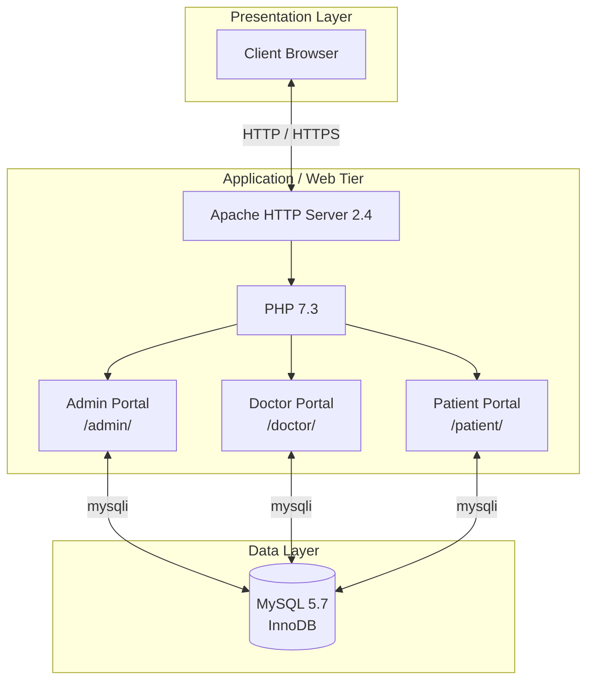
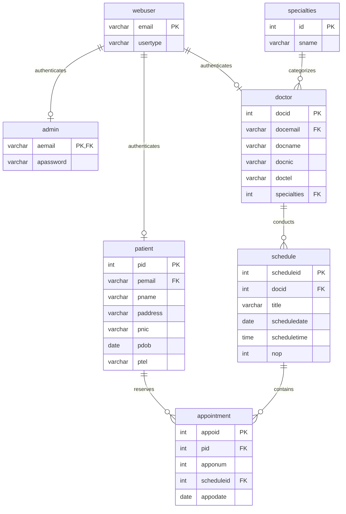
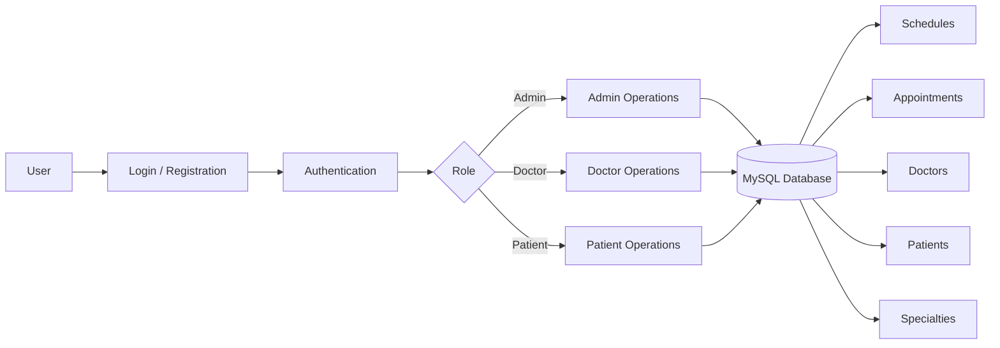

# 🏥 eDoc — Healthcare Appointment System

<p align="center">
  <strong>A relational database-driven healthcare appointment management platform</strong><br/>
  Built with PHP, MySQL, Apache, HTML5, CSS3, and JavaScript.
</p>

<p align="center">
  <a href="https://www.php.net/"></a>
  <a href="https://www.mysql.com/"></a>
  <a href="https://httpd.apache.org/"></a>
  
  
  
</p>

---

## 📖 Overview

**eDoc** is a web-based Healthcare Appointment Management System designed to streamline appointment scheduling and coordination between **administrators, doctors, and patients**.

The application combines a role-based PHP web application with a structured **MySQL relational database**, providing workflows for doctor management, specialty classification, consultation-session scheduling, patient registration, and appointment booking.

The project was developed as part of the **Database Systems (BCSE302)** coursework, with particular emphasis on relational modeling, normalization, referential integrity, and database-backed application workflows.

### Core goals

- Centralize healthcare appointment data in a structured relational database.
- Reduce manual scheduling conflicts and fragmented records.
- Provide role-specific workflows for administrators, doctors, and patients.
- Maintain referential integrity through primary and foreign key relationships.
- Demonstrate practical database design using a normalized **3NF** schema.

---

##  Features

###  Administrator Portal

- **Doctor Management** — Create, view, update, and remove doctor profiles.
- **Specialty Management** — Associate doctors with medical specialties.
- **Session Scheduling** — Create consultation sessions with dates, times, and patient capacity.
- **Patient Oversight** — View registered patient information.
- **Appointment Monitoring** — Review appointment and booking activity.

###  Doctor Portal

- **Schedule Dashboard** — View upcoming and daily consultation sessions.
- **Appointment Management** — Review patients booked into assigned sessions.
- **Patient Details** — Access relevant patient information associated with appointments.
- **Profile Management** — Manage account details and account-related settings.

###  Patient Portal

- **Self Registration** — Create a patient account.
- **Doctor Discovery** — Search doctors by medical specialty.
- **Appointment Booking** — Select available sessions and reserve appointment slots.
- **Booking History** — View current and previous appointments.
- **Profile Management** — Update personal information or remove the account.

---

##  System Architecture

eDoc follows a traditional **three-tier architecture** separating the presentation, application, and data layers.



### Layer responsibilities

| Layer | Technology | Responsibility |
|---|---|---|
| **Presentation** | HTML5, CSS3, JavaScript | User interface, forms, dashboards, and client-side interactions |
| **Application** | PHP 7.3 + Apache 2.4 | Authentication, session control, business logic, request routing, and database operations |
| **Data** | MySQL 5.7 + InnoDB | Persistent storage, relationships, constraints, and transactional data integrity |

---

##  Authentication & Request Routing

Authentication is centralized through the `webuser` table. Each authenticated account is associated with a role that determines which application portal it can access.

```text
                         ┌─────────────────────┐
                         │    User Login       │
                         └──────────┬──────────┘
                                    │
                                    ▼
                         ┌─────────────────────┐
                         │  webuser Validation │
                         │ email + usertype    │
                         └──────────┬──────────┘
                                    │
              ┌─────────────────────┼─────────────────────┐
              │                     │                     │
              ▼                     ▼                     ▼
       ┌─────────────┐       ┌─────────────┐       ┌─────────────┐
       │ usertype = a│       │ usertype = d│       │ usertype = p│
       └──────┬──────┘       └──────┬──────┘       └──────┬──────┘
              │                     │                     │
              ▼                     ▼                     ▼
       Admin Portal          Doctor Portal         Patient Portal
        /admin/               /doctor/               /patient/
```

### Role mapping

| Role | `usertype` | Portal |
|---|---:|---|
| Administrator | `a` | `/admin/` |
| Doctor | `d` | `/doctor/` |
| Patient | `p` | `/patient/` |

---

##  Database Design

The database is designed around a normalized relational model targeting **Third Normal Form (3NF)**. The schema uses primary keys and foreign keys to maintain relationships between authentication, doctors, specialties, patients, schedules, and appointments.

### Entity-Relationship Diagram



### Database tables

| Table | Purpose | Primary Key |
|---|---|---|
| `webuser` | Unified authentication and role routing | `email` |
| `admin` | Administrator account credentials | `aemail` |
| `specialties` | Medical specialty categories | `id` |
| `doctor` | Doctor profiles and specialty relationships | `docid` |
| `patient` | Registered patient information | `pid` |
| `schedule` | Doctor consultation sessions and capacity | `scheduleid` |
| `appointment` | Patient bookings against scheduled sessions | `appoid` |

### Relationship model

```text
webuser
  ├── 1 : 0..1 ── admin
  ├── 1 : 0..1 ── doctor
  └── 1 : 0..1 ── patient

specialties
  └── 1 : N ───── doctor
                    │
                    └── 1 : N ───── schedule
                                      │
                                      └── 1 : N ───── appointment
                                                        │
                                                        └── N : 1 ── patient
```

---

##  Application Modules

The application is divided into role-specific modules.

### `/admin`

| File | Responsibility |
|---|---|
| `doctors.php` | Doctor CRUD operations and profile management |
| `schedule.php` | Create and manage consultation sessions |
| `patients.php` | Patient information and appointment oversight |

### `/doctor`

| File | Responsibility |
|---|---|
| `index.php` | Doctor dashboard and upcoming sessions |
| `appointment.php` | View appointments and associated patient details |

### `/patient`

| File | Responsibility |
|---|---|
| `booking.php` | Search sessions and reserve appointment slots |
| `appointment.php` | View booking history and appointment status |

---

##  Security & Session Control

Protected application routes use PHP sessions to enforce role-based access.

The application checks:

```php
$_SESSION['user']
$_SESSION['usertype']
```

before allowing access to protected portal functionality.

### Access flow

```text
Request protected route
        │
        ▼
Is an authenticated session present?
        │
    ┌───┴───┐
    │       │
   YES      NO
    │       │
    ▼       ▼
Check role  Redirect
    │       to login.php
    ▼
Load authorized portal
```

Direct navigation to protected areas such as `/admin/`, `/doctor/`, and `/patient/` without an active authenticated session redirects the user to `login.php`.

> **Production note:** This project is designed as an academic project. For production healthcare use, additional controls would be required, including secure password hashing, prepared statements throughout the codebase, CSRF protection, input validation, HTTPS enforcement, audit logging, least-privilege database credentials, secure session configuration, and privacy/compliance controls.

---

##  Technology Stack

| Component | Version / Technology |
|---|---|
| **Web Server** | Apache HTTP Server 2.4.39 |
| **Backend** | PHP 7.3.5 |
| **Database** | MySQL 5.7.26 |
| **Storage Engine** | InnoDB |
| **Frontend** | HTML5, CSS3, JavaScript |
| **Database Driver** | PHP `mysqli` |
| **Local Environment** | XAMPP / WAMP |

### Requirements

Before installation, make sure your local environment provides:

- Apache HTTP Server
- PHP 7.3.x
- MySQL 5.7.x
- phpMyAdmin or another MySQL administration tool
- A modern web browser
- Git

---

## 🚀 Installation & Setup

### 1. Clone the repository

```bash
git clone https://github.com/YOUR-USERNAME/healthcare-appointment-system.git
cd healthcare-appointment-system
```

### 2. Move the project into your web root

#### XAMPP

```text
C:\xampp\htdocs\healthcare-appointment-system
```

#### WAMP

```text
C:\wamp64\www\healthcare-appointment-system
```

### 3. Start the local services

Start the following services from your local server control panel:

- Apache
- MySQL

### 4. Create the database

Open phpMyAdmin:

```text
http://localhost/phpmyadmin/
```

Create a database named:

```text
edoc
```

### 5. Import the schema

Import the project's database schema:

```text
database/schema.sql
```

The schema should create the required tables and relationships for the application.

### 6. Configure the database connection

Update the project's database configuration with your local MySQL credentials.

Typical local development settings are:

```text
Host:     localhost
Database: edoc
Username: root
Password: <your-local-password>
```

### 7. Run the application

Open:

```text
http://localhost/healthcare-appointment-system/index.html
```

---

## 🔄 Core Booking Workflow

The primary patient booking lifecycle can be represented as:

```text
Patient Login
     │
     ▼
Browse Medical Specialties
     │
     ▼
Select Doctor
     │
     ▼
View Available Sessions
     │
     ▼
Select Appointment Slot
     │
     ▼
Create Appointment
     │
     ▼
Appointment History
```

On the provider side:

```text
Doctor Login
     │
     ▼
View Scheduled Sessions
     │
     ▼
Open Session
     │
     ▼
Review Booked Patients
     │
     ▼
Manage Appointment Information
```

Administrators provide the operational foundation:

```text
Admin Login
     │
     ├── Manage Doctors
     │
     ├── Manage Specialties
     │
     ├── Create Sessions
     │
     ├── Review Patients
     │
     └── Monitor Appointments
```

---

## 📊 Functional Data Flow



---

##  Development Notes

This project is suitable for demonstrating:

- Relational database design
- Entity-relationship modeling
- Database normalization
- CRUD operations
- PHP/MySQL integration
- Session-based authentication
- Role-based application routing
- Appointment scheduling workflows
- Foreign-key relationships
- Basic full-stack web application architecture

For production deployment, the application should be modernized beyond the legacy PHP 7.3/MySQL 5.7 stack and reviewed for security, maintainability, privacy, scalability, and compliance requirements.


## 📄 License

This project is licensed under the **MIT License**.

See [`LICENSE`](LICENSE) for the full license text.

